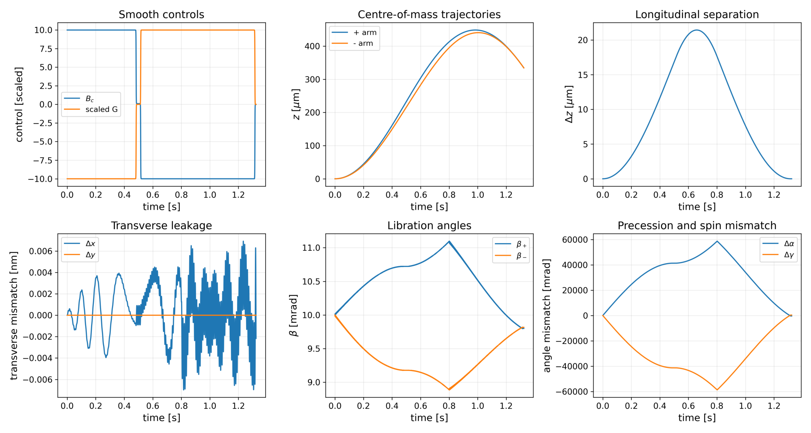
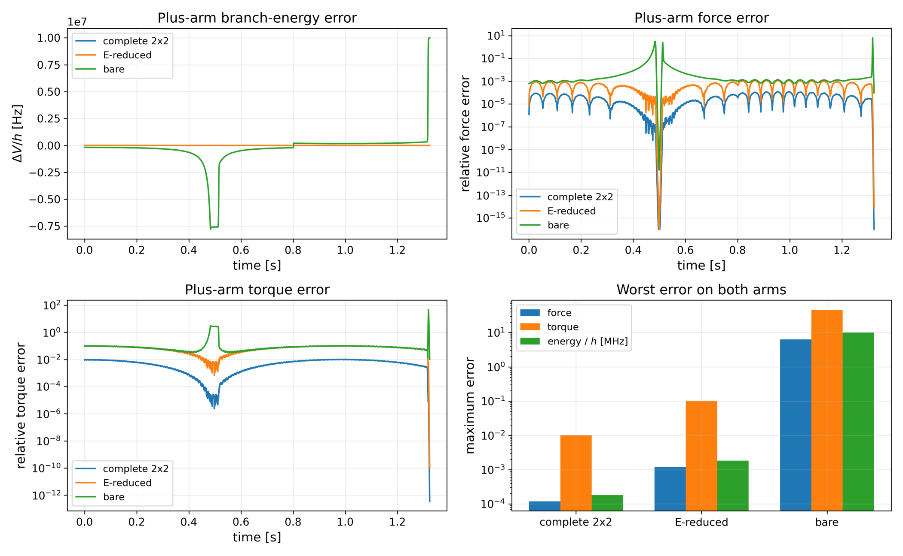
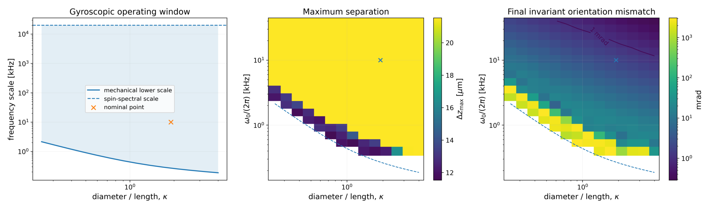
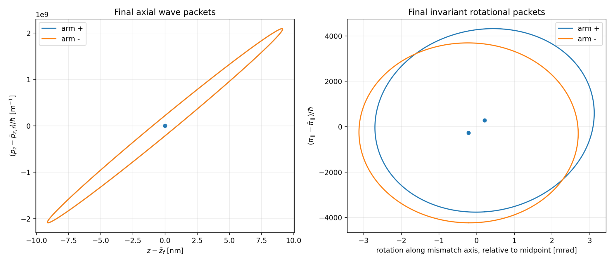
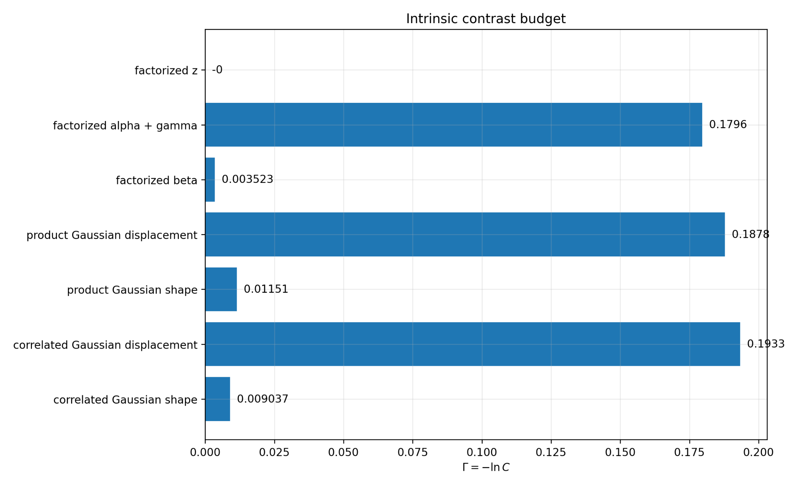
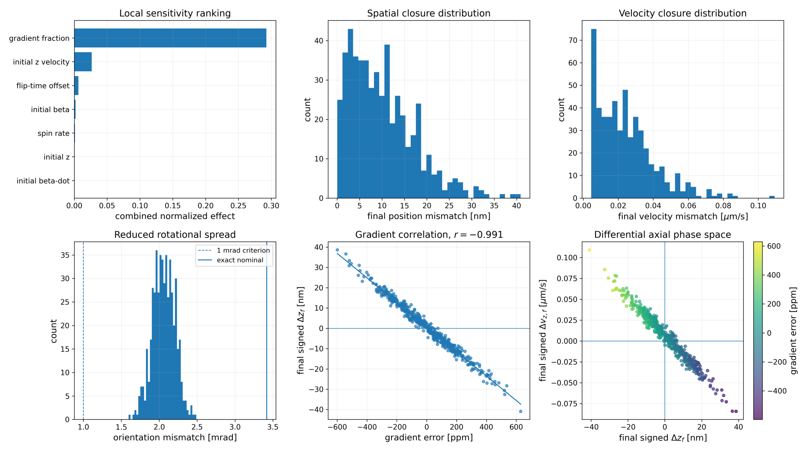

# MSc Physics Thesis

## From Rotations to Spin Contrast:
### Semiclassical and Quantum Dynamics of Spin-Embedded Nanorotors in Stern–Gerlach Interferometry

**Vlad-Haralambie Ispas**  
MSc Physics — Quantum Universe track  
University of Groningen, 2026

**Supervisor:** Prof. Anupam Mazumdar

[**View the full thesis (PDF)**](./MScQPThesis_Vlad_Haralambie_Ispas.pdf)

---

## Abstract

This thesis investigates whether a spinning nanodiamond can be separated into two spin-conditioned paths and recombined without its mechanical state retaining information about which path was taken.

The system is an axially symmetric, diamagnetic cylindrical nanorotor containing an embedded spin-1 nitrogen-vacancy (NV) centre. A Stern–Gerlach magnetic-field sequence creates and recombines the two paths, while rapid mechanical rotation stabilises the rotor. The work is motivated by **quantum-gravity-induced entanglement of masses (QGEM)**, which proposes to test whether gravity can mediate entanglement between mesoscopic objects in spatial superpositions.

Starting from rotation theory and rigid-body mechanics, I derive a three-dimensional semiclassical model coupling translation, orientation and the internal quantum spin. Controlled reductions are then compared with the full spin Hamiltonian through their energies, forces, torques and accumulated trajectories. Numerical calculations test smooth control sequences, gyroscopic stability, interferometric closure and sensitivity to preparation and control errors.

At the nominal operating point, the full three-dimensional calculation predicts **21.44 µm of branch separation and a final centre-of-mass mismatch of only 0.673 nm**, while leaving a **3.42 mrad orientation mismatch**. A separate quantum calculation around a centred, aligned reduction gives an intrinsic mechanical spin contrast of **approximately 0.817**. Its dominant limitation is the remaining rotational phase-space displacement.

The central result is that **spatial recombination and stable rotation do not guarantee quantum closure**. Recovering spin coherence also requires the two branches to agree in orientation, angular momentum, wave-packet widths and correlations.

## Physical model and approach

The semiclassical description treats the centre of mass and rotor orientation classically, while obtaining the branch potentials from the internal quantum spin. The full model retains the defect's displacement from the centre, its spin-axis geometry, the three-dimensional magnetic field, diamagnetism, gravity and confinement.

The model hierarchy connects several descriptions:

| Description | Role in the calculation |
|---|---|
| Rotation theory and rigid-body mechanics | Derive moving frames, angular velocity, inertia and canonical dynamics. |
| Full **3 × 3** spin Hamiltonian | Resolve all three spin-1 levels and determine the adiabatic branch forces and torques. |
| Effective **2 × 2** spin Hamiltonian | Eliminate the $m_s=0$ component perturbatively and test the resulting approximation. |
| Centred, aligned reference reduction | Study axial splitting, gyroscopic behaviour and parameter dependence efficiently. |
| Local quantum fluctuations | Propagate wave-packet widths and correlations around the semiclassical paths and calculate their overlap. |

Here, **“exact” refers to the full internal spin Hamiltonian within the stated semiclassical and adiabatic assumptions**. It does not mean a global quantum solution for every mechanical degree of freedom. The main numerical trajectories use point-particle diamagnetism, with finite-volume corrections assessed separately.

## Spatial closure and rotational mismatch

The nominal nanorotor has mass **10⁻¹⁷ kg**, length **100 nm**, radius **95.365 nm**, initial tilt **0.01 rad** and axial rotation frequency **10 kHz**. Its smoothly switched interferometric sequence lasts approximately **1.324 s**.

*Full 3 × 3 semiclassical calculation: the control sequence produces a large relative separation followed by spatial recombination, while the rotational paths remain distinguishable. Thesis Fig. 9, p. 65.*

| Quantity | Full three-dimensional semiclassical result |
|---|---:|
| Maximum branch separation | **21.4358 µm** |
| Final centre-of-mass position mismatch | **0.673 nm** |
| Final relative velocity magnitude | **0.00670 µm/s** |
| Final invariant orientation mismatch | **3.419 mrad** |
| Final angular-momentum mismatch | **9.76 × 10⁻³⁰ J s**, or **0.342%** of the initial mechanical angular momentum |
| Minimum spin gap during the sequence | **20.0 MHz** |

*Nominal results from thesis Table 6, p. 76. The gap depends on the chosen transverse spin splitting and control sequence.*

The two branches therefore return extremely close to one another in position and momentum, but their rotors do not return to the same mechanical state. Their common centre-of-mass excursion also reaches **444.45 µm**, which sets a separate requirement on apparatus size and field linearity.

Rotational closure is evaluated using the physical relative rotation in **SO(3)**, the group of three-dimensional rotations. Raw Euler-angle differences can give a misleading impression of the mismatch because different angular changes can largely cancel in the actual orientation.

## Why the full spin Hamiltonian matters

An approximation can reproduce the translational dynamics accurately while still mispredicting rotational recombination.

The complete effective **2 × 2** model reproduces the full model's spin force with a maximum relative error of **1.19 × 10⁻⁴**. Its torque error is approximately **1%**, however, and the accumulated dynamics give a final orientation mismatch of **2.089 mrad rather than 3.419 mrad**: a **39% error** in the residual.

*Approximation audit on the same exact trajectories. Energy, force and torque are tested separately because small local errors can accumulate differently. Thesis Fig. 15, p. 71.*

This establishes where the reduced description is useful: it supports efficient timing and sensitivity scans, while quantitative rotational closure requires the full spin spectrum.

## Gyroscopic stability and design trade-offs

Rapid mechanical rotation stabilises the branches associated with the $m_s=\pm1$ spin projections, enabling the larger Stern–Gerlach splitting of that pair. Stabilisation nevertheless leaves a separate problem of matching the final rotational states.

*Gyroscopic design scan in the reference model. The maps distinguish a stable trajectory from one with small final orientation mismatch. Thesis Fig. 16, p. 72.*

The scan varies the rotation rate and cylinder aspect ratio, defined as diameter divided by length. It shows that a rotor can remain locally stable while accumulating a substantial orientation mismatch; good recombination imposes a stronger requirement than stability alone.

Mass scans reveal another trade-off. With the controls held fixed, maximum separation scales approximately as **1/mass**, while increasing mass suppresses rotational mismatch. Rotation rate and cylinder geometry therefore offer additional ways to improve closure without the same direct loss of spatial separation.

## From classical trajectories to quantum contrast

The quantum calculation follows finite wave packets around the semiclassical paths. Their centres alone are insufficient: the calculation also propagates the widths and correlations in axial motion and all three local rotational canonical pairs.

For a pure mechanical preparation, the intrinsic contrast is the magnitude of the overlap between the two final branch-conditioned states:

$$
C = \left|\langle\psi_-(t_f)\mid\psi_+(t_f)\rangle\right|.
$$

Here, $\psi_\pm$ are the mechanical states associated with the two spin branches and $t_f$ is the final time. Both rotational states are compared in a common local coordinate system on SO(3), with the conjugate momenta and covariances transformed consistently.

**This calculation uses a separately retimed, centred, aligned and axially constrained reduction.** It is not the quantum contrast of the full off-centre trajectory reported above. Its maximum separation is **21.5047 µm**, its axial centres close to numerical precision, and its invariant orientation mismatch is **0.424247 mrad**.

*Reduced quantum calculation: axial packets recombine, while the rotational packets retain differences in their centres and shapes. Ellipses show two-standard-deviation contours. Thesis Fig. 20, p. 82.*

Including the propagated Gaussian covariance and the correlations in the prepared rotor state gives

$$
C_{\mathrm G} = 0.8168035 \pm 9.5\times10^{-6}, \qquad -\ln C_{\mathrm G} = \Gamma_{\mathrm{disp}} + \Gamma_{\mathrm{shape}} \simeq 0.193320 + 0.0090367.
$$

The quoted uncertainty is a **numerical convergence estimate**. The two contributions describe final displacement measured relative to the packet widths, and differences in packet shape. Approximately **95.5% of the contrast exponent** comes from displacement and **4.5%** from differential squeezing and correlations.

*Contrast calculations resolve where mechanical distinguishability remains. The axial contribution is negligible; rotational recombination controls the main loss. Thesis Fig. 21, p. 83.*

An independent nonlinear wavefunction calculation for the central libration sector gives an overlap of **0.9989966**. This is an isolated-sector check, not the complete contrast: it shows that deformation of that libration mode alone does not explain the larger loss when the full reduced rotational phase space is included.

Reference-level thermal calculations also examine how libration temperature and gyroscopic frequency affect coherence; they do not constitute a finite-temperature prediction for the complete multimode contrast.

## Sensitivity to preparation and control

A **512-sample Monte Carlo ensemble** tests illustrative Gaussian uncertainties in preparation and control using the complete effective **2 × 2** model.

*Sensitivity and robustness under the stated uncertainty model. The rotational distribution belongs to the reduced model; the full model's nominal result is shown separately. Thesis Fig. 18, p. 74.*

The dominant translational sensitivity is **magnetic-gradient calibration**. A one-standard-deviation gradient error of **200 ppm** changes the signed final axial residual by approximately **12.1 nm**. Its correlation with that residual is **−0.991**.

All sampled trajectories meet the illustrative **100 nm position** and **1 µm/s velocity** tolerances, but none meets the **1 mrad orientation** target. These results identify which controls matter under the assumed uncertainties; they are not an experimental success probability.

## Numerical methods and verification

The computational work links the analytical model to independently checked observables:

- **Symbolic verification:** rotation, field and spin expressions checked against their numerical implementations, including local Maxwell constraints and energy derivatives.
- **Quaternion propagation:** fourth-order Runge–Kutta evolution avoids the Euler-coordinate singularity near alignment; selected trajectories are cross-checked against canonical Euler equations.
- **Spin-branch tracking:** eigenvector continuity identifies the followed states through avoided crossings instead of relying on eigenvalue ordering alone.
- **Convergence and model comparisons:** timestep refinement, finite-difference force and torque checks, parameter scans, and separate tests of finite-volume diamagnetism and spin–rotation corrections.
- **Quantum propagation:** Gaussian covariance evolution, a consistent rotational coordinate transformation, and an independent nonlinear libration calculation with grid, basis and timestep checks.

## Scope and remaining control requirements

The calculation provides a **single-nanorotor mechanical benchmark for a QGEM-motivated interferometer**. It does not calculate the gravitational entangling phase or the visibility of a complete two-mass experiment.

Several assumptions matter when interpreting the results:

- The reconstructed magnetic trap is mechanically stable but fails the spin-compatibility test. The working interferometer therefore assumes a separate gravity-compensated guide; its engineering implementation is not established here.
- Spin inversion is treated as an ideal branch exchange. The calculations identify arm-dependent transition frequencies and weak direct coupling, so realistic preparation, exchange and final readout require a driven multilevel treatment.
- The reported quantum contrast is a local Gaussian calculation in the reduced geometry. Extending it to all six mechanical modes around the verified full trajectories remains further work.
- Environmental decoherence, current noise and spin dephasing are excluded from the intrinsic mechanical contrast.

The next step is to combine the full trajectories, quantum covariance evolution and realistic controls in one calculation, optimising the complete mechanical overlap rather than spatial closure alone.

## Thesis roadmap

| Chapters | Content |
|---|---|
| **2–3** | Rotation theory, moving frames and rigid-body mechanics. |
| **4** | Spin-conditioned Hamiltonian, forces, torques and controlled reductions. |
| **5** | Calibration, semiclassical trajectories, approximation tests and robustness. |
| **6** | Quantum wave packets, mechanical overlap, intrinsic spin contrast and thermal extensions. |
| **7–8** | Interpretation, limitations and priorities for further work. |

All figures and numerical results above are taken from the [full thesis](./MScQPThesis_Vlad_Haralambie_Ispas.pdf).
